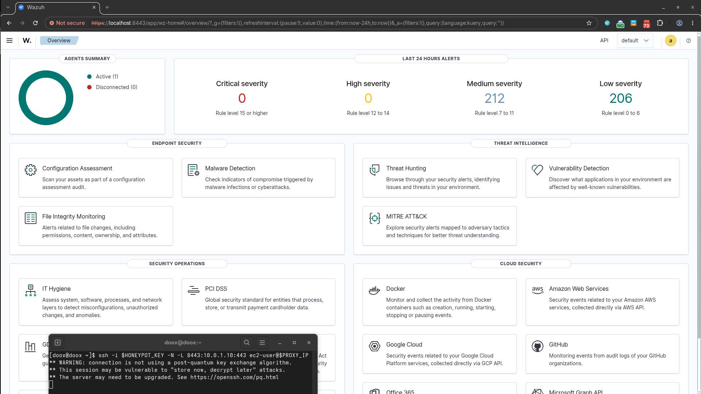

# 📓 Project Progress Log

This document serves as a chronological record of the development process, milestones achieved, and technical challenges resolved during the creation of this project.

### Move Wazuh Manager to local env
* **Cycle / Week:** 
* **Status:** 

**🎯 Objectives:**
* 
* 

**✅ Accomplishments:**
* 
* 

**🐛 Challenges & Troubleshooting:**
* *Issue:* 
* *Solution / Workaround:* 

---

### Terraform Introduction and AWS Setup
* **Week:** Week 1
* **Status:** In Progress

**🎯 Objectives:**
* Learn Terraform Basics
* Write environment setup in Terraform - EC2, VPC, Security Groups, Internet Gateway, Elastic IP

**✅ Accomplishments:**
* Basics of Terraform - 2 EC2s deployed via IaC
* Packer - vendor independent(HashiCorp) tool for building AMI Images
* Wazuh Manager + Agent deployment and connection
* Phase 1 done - Wazuh Manager and Cowrie honeypot deployed on EC2s with secure access to Wazuh via AWS Systems Manager

**🐛 Challenges & Troubleshooting:**
* *Issue:* Saving AMI state with minimizing cloud costs - Stopping EC2 between sessions will generate costs(EC2, EIP, EBS), but configuring everything every time from scratch will drive me crazy  
* *Solution:* Create custom AMI or search for automated solution -> HashiCorp Packer vs EC2 Image Builder -> Packer as vendor independent solution -> Terraform for whole infrastructure and Packer AMI images for latest builds

* *Issue:* How to connect to Wazuh in the Cloud Native phase?
* *Solution:* Easiest way - access through Internet, also most insecure(Wazuh instance will have to be publicly available) -> SSH port forwarding, better security, especially with Security Group restricting access only to my home IP, a bit more tricky -> https://aws.amazon.com/blogs/aws/new-port-forwarding-using-aws-system-manager-sessions-manager/ - much harder to configure(VPC Endpoint, EC2 role, SSM plugin) but even more secure method - professional approach

1st bigger success - Wazuh Server/indexer/dashboard connected with agent, both on EC2s, manager accessed via SSH forwarded port 

Wazuh acces without Internet access
![[Pasted image 20260702170740.png]]

~3h later:
![[Pasted image 20260702201341.png]]

Logs from 17:35 - configuration checks. Real brute force attacks started from 19:18.
![[Pasted image 20260702201418.png]]

![[Pasted image 20260702201554.png]]

Some IPs
![[Pasted image 20260702202207.png]]

Few more hotspots before leaving setup for night:
![[Pasted image 20260702205900.png]]